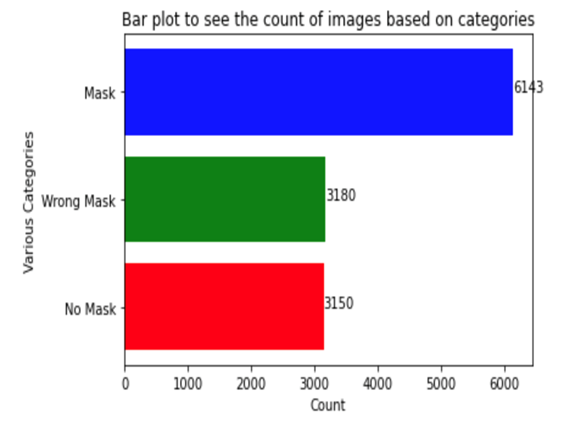
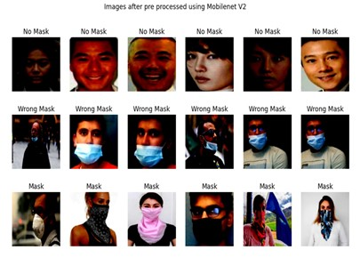
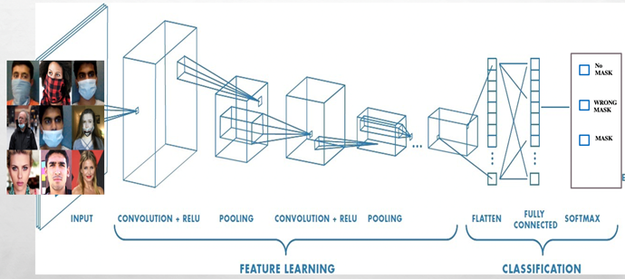
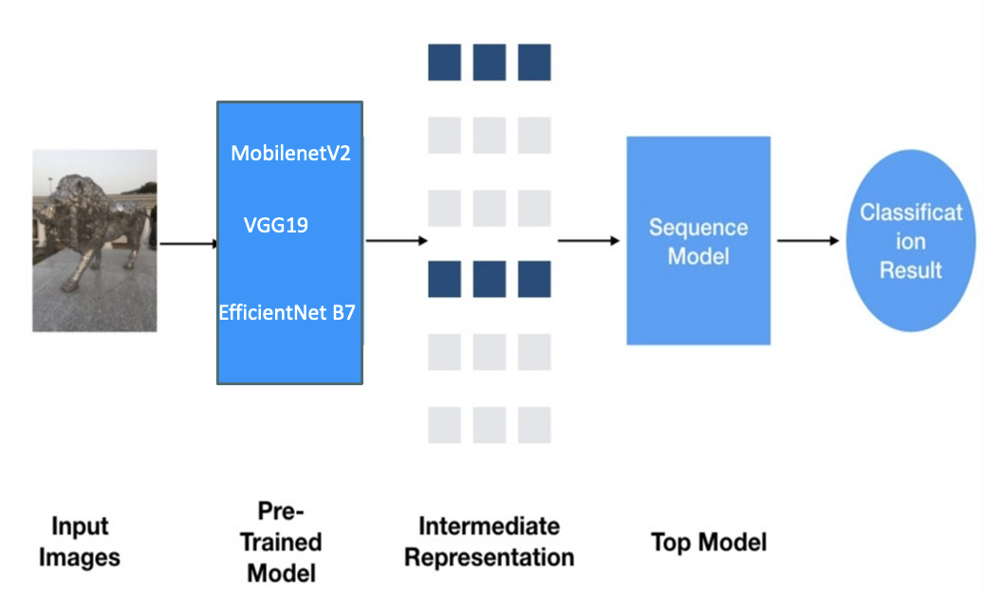
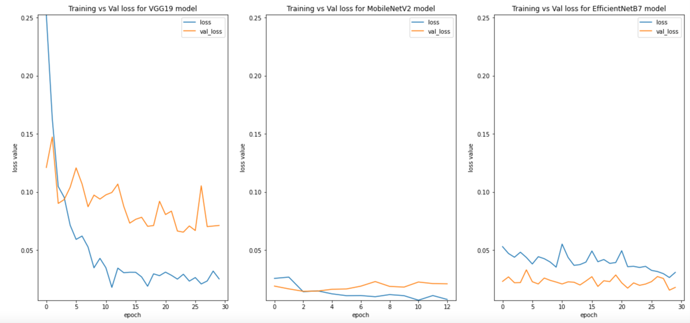
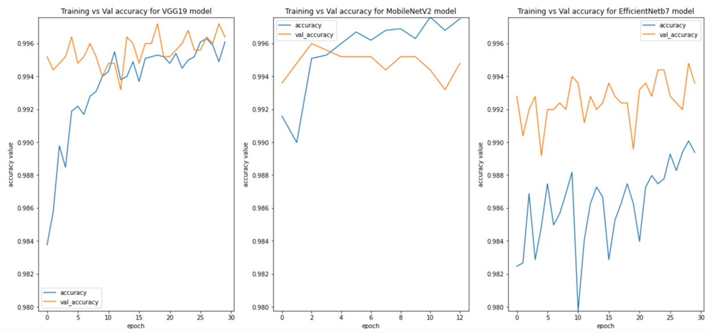
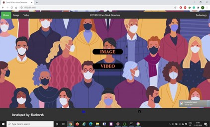
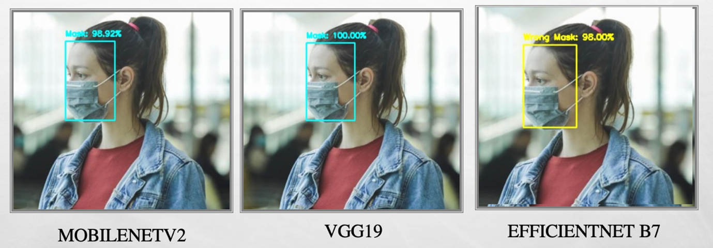
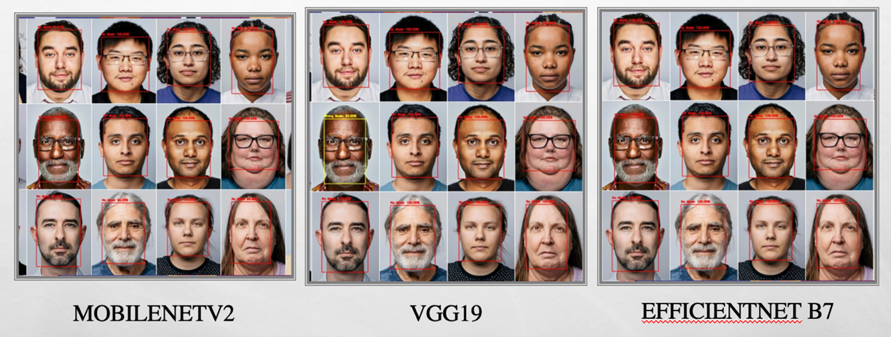

# Covid-19 Multi Label Face Mask Detection

This project is under preservation of copyright and license notices from MIT.

## Table of Contents
- [About The Project](#-About-The-Project)
- [Built With](#Built-With)
- [Getting Started](#Getting-Started)
- [Installation](#Installation)
- [Data Creation](#Data-Creation)
- [Data Preprocessing](#Data-Preprocessing)
- [CNN](#CNN)
- [Transfer Learning](#Transfer-Learning)
- [Hyper parameter Tuning](#Hyper-parameter-Tuning)
- [Model Creation](#Model-Creation)
- [Face Detection](#Face-Detection)
- [Model Deployment](#Model-Deployment)

- [Contact](#Contact)
- [Acknowledgements](#Acknowledgements)

### About The Project
The spread of the COVID-19 pandemic has produced the world's most critical global health epidemic that has had a profound effect on society and the way we view our world and our daily lives. At the moment, WHO recommends that people should wear face masks if they have respiratory symptoms, or they are taking care of the people with symptoms. Furthermore, many public service providers require customers to use the service only if they wear masks. Therefore, face mask detection has become a crucial computer vision task to help the global society, but research related to face mask detection is limited.  This repository is used to predict whether the person is wearing a face mask appropriately to prevent COVID 19 virus. Data is being classified into No_Mask, Wrong_Mask and Mask.

### Built With
Below are the list of key scientific libraries / tools used to accomplish this project.
- Tensorflow==2.3.0
- Keras==2.4.0
- OpenCV==4.1.2 (Face Detection, Bounding Box Creation)
- Google Colab Pro
- Flask==1.1.2
- Keras-Tuner==1.0.2

### Installation
1.    Clone this git repository using git bash here with below command:

      git clone https://github.com/cr7manju/Covid-19-Multi-Label-Face-Mask-Detection.git
      
2.    Change your directory to the cloned repository and create a Python virtual environment named "FaceMaskDetection"

      $ mkvirtualenv FaceMaskDetection
      
3.    Activate the above environment using "activate FaceMaskDetection"

4.    Now, run the following command in Terminal/Command Prompt in the above environment to install the libraries required
      
      $ pip install -r requirements.txt
               
### Data Creation
Dataset used in this project has been collected from various search engines like Google images, Kaggle. 

### Data Preprocessing
In this stage data undergoes Resizing, Convertion to arrays, Scaling Data, Labelling Data and label convertion to categorical values for modelling. 

### CNN
One of the key groups for image recognition, image classification, is the Convolutionary Neural Network (CNNs). An input image is taken from CNN image classifications, processed and categorised under those categories. Computers see an input image as a pixel array and this depends on the resolution of the image. It can see batch_size * h * w * d (h = Height, w = Width, d = Depth) based on the image resolution.

### Transfer Learning
Transfer learning typically refers to a method in which a model trained on one problem is somehow used on a second similar problem. Transfer learning has the advantage of minimising a neural network model's training time and can lead to lower errors in generalisation. The pre-trained model can be used as a separate feature extraction programme, in which case the model or portion of the model can pre-process input to a given output for each input image, which can then be used as input when a new model is trained.
MobilenetV2, VGGNet19, EfficientNet B7 transfer learning models being used in this project.

### Hyper parameter Tuning
Hyperparameter tuning is performed using keras-tuner which is an assignment for meta-optimization. Each trial involves training a model and an internal optimization method for a specific hyperparameter environment. The best hyperparameter setting is the outcome of hyperparameter tuning, and the best model parameter setting is the outcome of model training. 

Parameters used:

- Fully connected layer
- Dropout layer
- Learning Rate

### Model Creation 
For Model Generation use below steps post project installation steps:

Open anaconda console. Go into the cloned project directory and type the following command:

$ python training_mask_detection.py --dataset dataset --output output

Training and Validation Loss comparision:

Training and Validation Accuracy comparision:

### Face Detection
In this analysis, the Caffe Model is used in the image generated by the input device to perform a face selection. This needs to be achieved in order to generate the desired output of the prediction process that has been carried out at the training data level.

### Model Deployment
To deploy the model on the localhost run 'python app.py' command in above environment:
 
$ python app.py

Application will be deployed at "http://127.0.0.1:5000/", user can upload images or pass web video as input to verify the model.

Verification with some input images:
1. Mask image

2. No Mask

### Contact
For any queries contact at:
- manjuron7@gmail.com
- Project Link: https://github.com/cr7manju/Covid-19-Multi-Label-Face-Mask-Detection.git

### Acknowledgements
- [Transfer Learning](https://machinelearningmastery.com/how-to-usetransfer-learning-when-developing-convolutional-neural-networkmodels/)
- [Keras Tuner](https://www.tensorflow.org/tutorials/keras/keras_tuner)
- [CNN](https://medium.com/@RaghavPrabhu/understanding-ofconvolutional-neural-network-cnn-deep-learning-99760835f148)
- [Face Detection](https://towardsdatascience.com/face-detection-models-which-to-use-and-why-d263e82c302c)
